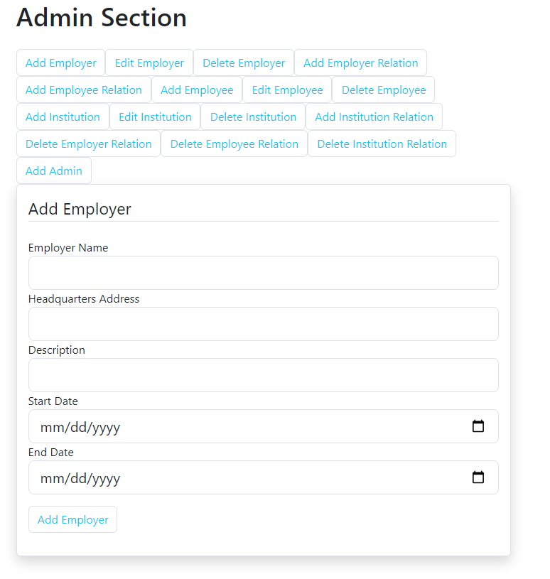
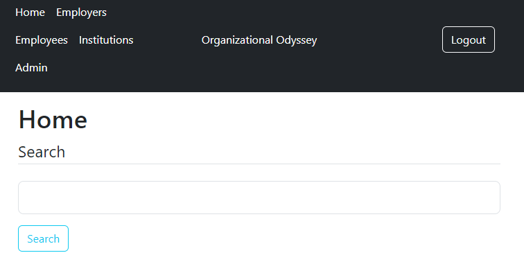

---

# Organizational Odyssey

## Overview

Organizational Odyssey is a Flask-based web application designed to streamline the management and visualization of organizational data, specifically focusing on the relationships between employees, departments, and locations. This project aims to provide a comprehensive solution for businesses to efficiently handle their internal structure data, enhancing decision-making processes through intuitive data visualization and management tools.

## Features

- **Employee Management**: Simplified interface for adding, updating, and removing employee records.
- **Institution Visualization**: Graphical representation of the organizational structure, showcasing the hierarchy and relationships between different departments and locations.
- **Secure User Authentication**: Robust login system with email confirmation for secure access to the system. See a [demo of the email confirmation process](https://calebmcquay.pythonanywhere.com/confirm/gAAAAABmCyahm3KXsAEDsnyNKrl_sWNgNJOTpeo4wHOqT97iwmUFQkfZ9JGU0uwQehMXZk23-Y8LhhtqoHC51cIwGPNRAiWOBl06wtXWiMgfgpstJSSrn1o=).
- **Interactive Data Visualization**: Utilize visualization tools to represent organizational data dynamically, making it easier to digest and analyze.

- ## Screenshots
Here are some screenshots of the project:

 <br>


## Getting Started

### Prerequisites

- Python 3.6+
- Flask
- SQLAlchemy
- PostgreSQL
- Flask extensions such as Flask-Login, Flask-Mail, Flask-Bcrypt for authentication and security.

### Installation

Follow these steps to get your development environment set up:

1. **Clone the repository**

```bash
git clone https://github.com/RyanEbsen/OrganizationnalOdyssey.git
cd OrganizationnalOdyssey
```

2. **Install Python dependencies**

```bash
pip install -r requirements.txt
```

3. **Set up the environment variables**

Create a `.env` file in the root directory and populate it with your database URI and email server settings as shown in `flask_app.py`.

4. **Initialize the database**

```bash
flask db upgrade
```

5. **Run the application**

```bash
flask run
```

The application should now be accessible at `http://localhost:5000`.

## Usage

### Quick Start

To quickly sign up and start using Organizational Odyssey, visit the [Register page](https://calebmcquay.pythonanywhere.com/register).

After logging in, users can navigate through the dashboard to manage employees, view the organizational structure, and access various data visualizations. The system allows for detailed management of employee records and provides insights into the organizational hierarchy through interactive charts and graphs.

## Contributing

Contributions are welcome! If you have suggestions for improving Organizational Odyssey, please open an issue or submit a pull request.

## License

This project is licensed under the MIT License - see the [LICENSE.md](LICENSE.md) file for details.

## Acknowledgments

- Flask for the backend framework
- SQLAlchemy for database ORM
- The Flask community for the numerous extensions and plugins
- All contributors who have helped shape Organizational Odyssey

---
